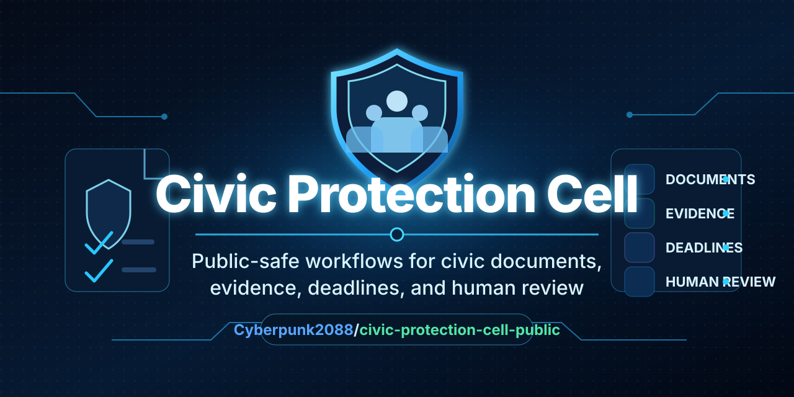

# Civic Protection Cell Public



**Public-safe workflows for civic documents, evidence, deadline-risk awareness and human review.**

Civic Protection Cell Public is a local-first, synthetic-data-only project layer for structuring civic or administrative paperwork without creating external action, legal advice or real-case automation.

> Documents in order. Evidence structured. Deadlines treated as risk signals. Human review stays mandatory.

## Quick Start

```bash
git clone https://github.com/Cyberpunk2088/civic-protection-cell-public.git
cd civic-protection-cell-public
python3 -m pip install -e ".[test]"
python3 -m pytest -q
python3 -m civic_protection_cell.demo
```

Expected posture:

```text
external_action: BLOCKED
allowed_external_action: false
real_data: PROHIBITED
synthetic_data: ONLY
human_review: REQUIRED
```

## What It Helps With

- document structure for civic and administrative workflows
- synthetic evidence-card concepts
- deadline-risk awareness without final deadline calculation
- local-first review output
- human review gating before any real-world use
- public-safe explanation of a protected private/commercial core boundary

## Important Notice

This project is not a law firm, not a legal service, not a public authority and not a court system.

Nothing in this repository is legal advice, tax advice or a final legal assessment. Any real matter, deadline, filing, takedown, complaint, protective action or commercial deployment requires qualified human review before use.

## Status

```text
REPOSITORY_NAME: civic-protection-cell-public
REPOSITORY_FULL_NAME: Cyberpunk2088/civic-protection-cell-public
REPOSITORY_VISIBILITY: PUBLIC
PUBLIC_RELEASE_PREP: OWNER_APPROVED
HUMAN_APPROVAL: GIVEN
HUMAN_APPROVAL_FILE: HUMAN_APPROVAL.md
LEGAL_REVIEW: OPEN / NOT_REPLACED_BY_OWNER_APPROVAL
TEST_STATUS: PASSED_LOCAL_PYTHON3
CI_STATUS: PASSED_OBSERVED
EXTERNAL_ACTION: BLOCKED
REAL_DATA: PROHIBITED
SYNTHETIC_DATA: ONLY
HUMAN_REVIEW: REQUIRED
PROTECTED_CORE: CONFIRMED_EXCLUDED
COMMERCIAL_CORE: PROTECTED
PAYMENT_ROUTE: PAYPAL_ONLY
TAX_NUMBER_PUBLICATION: NO
BANK_DATA_PUBLICATION: NO
```

## Repository Topics

Suggested GitHub topics for discovery:

```text
civic-tech
document-workflow
evidence
human-review
synthetic-data
legal-tech
workflow-automation
public-safe
local-first
deadline-management
```

## What This Repository Must Not Be Used For

Do not use this repository for:

- real legal filings
- real deadline calculation without qualified review
- automated reporting, takedown or submission
- processing personal data from real cases
- replacing lawyers, courts, authorities or qualified advisors
- publishing private tax, bank or identity data
- exposing protected commercial logic

## Safety Boundary

```text
DEFAULT_DECISION: NEEDS_HUMAN_REVIEW
AUTOMATED_EXTERNAL_ACTION: DISABLED
REAL_PERSONAL_DATA: DISALLOWED
DEMO_DATA: SYNTHETIC_ONLY
PAYMENT_ROUTE: PAYPAL_ONLY
COMMERCIAL_CORE: NOT_INCLUDED
```

## Public Contact / Provider Draft

Provider and contact information is maintained in `PROVIDER_INFO_DRAFT.md`.

The current public contact email is owner-supplied. Personal tax numbers, bank account details and private identifiers must not be published in this repository.

## Support / Sponsorship

Support and sponsorship information is documented in `SPONSORSHIP_AND_SUPPORT.md`.

Payment references are PayPal-only. A payment or donation does not create legal representation, does not approve external action and does not remove the human-review requirement.

## Contributing

See `CONTRIBUTING.md` before opening issues, pull requests or suggestions.

Contributions must preserve the public-safe boundary:

```text
no real data
no external action
no legal advice
no automatic submission
no protected-core publication
```

## Support

See `SUPPORT.md` for contact, sponsorship and paid-work boundaries.

## Human Approval

Owner human approval for public-release preparation is documented in `HUMAN_APPROVAL.md`.

This approval does not replace legal, tax, provider-identification, consumer-law or platform-policy review.

## Release Note

Human approval is documented. The repository is public-safe prepared and publicly visible.

Before public promotion or commercial use, complete the final owner check, provider/contact review, payment wording check and legal/tax review.
